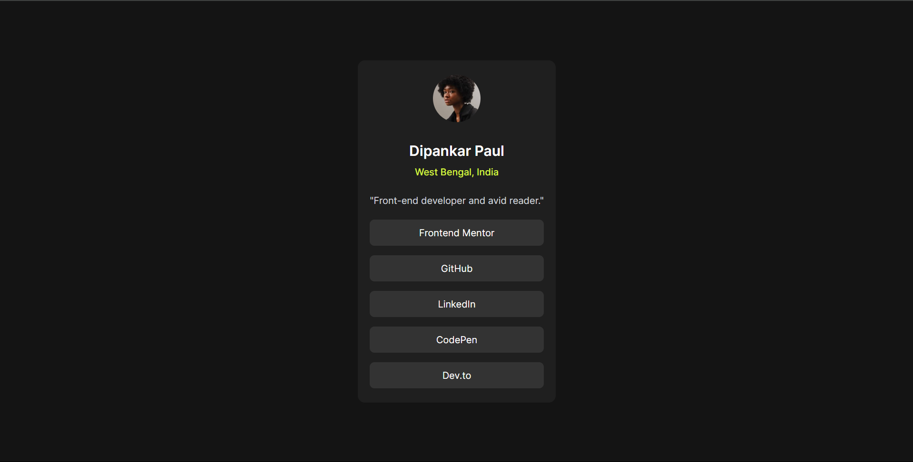
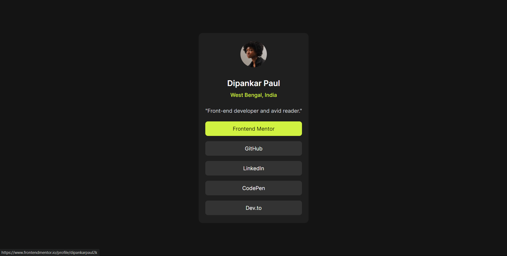
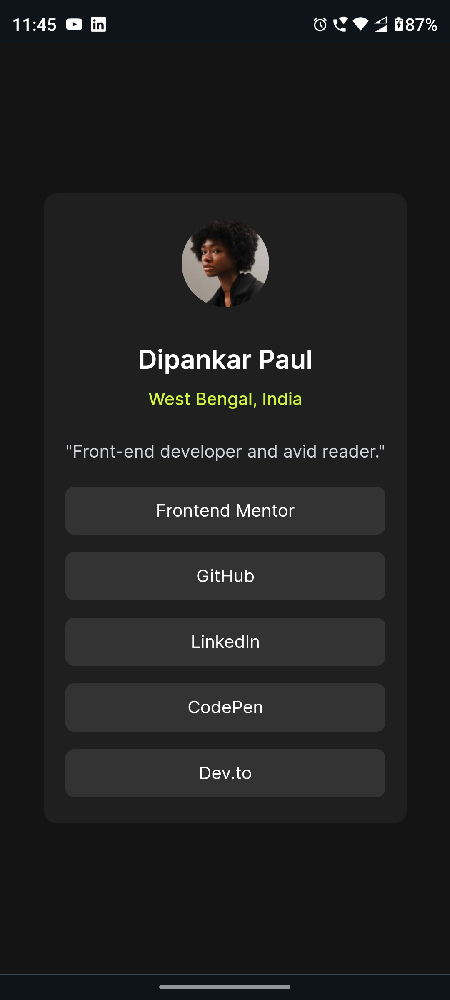

<!-- omit in toc -->
# Frontend Mentor - Social links profile solution

This is a solution to the [Social links profile challenge on Frontend Mentor](https://www.frontendmentor.io/challenges/social-links-profile-UG32l9m6dQ). Frontend Mentor challenges help you improve your coding skills by building realistic projects. 

<!-- omit in toc -->
## Table of contents

- [Overview](#overview)
  - [The challenge](#the-challenge)
  - [Screenshot](#screenshot)
  - [Links](#links)
- [Built with](#built-with)
- [Author](#author)

## Overview

### The challenge

Users should be able to:

- See hover and focus states for all interactive elements on the page

### Screenshot

    
Desktop view

    

      
    

    
Hover and active view

    

      
    

    
Mobile view

    

      
    

### Links

- [Solution URL](https://github.com/dipankarpaul2k/social-links-frontend-mentor.git)
- [Live Site URL](https://social-links-frontend-mentor.vercel.app/)

## Built with

- Semantic HTML5 markup
- Tailwind CSS
- ReactJs
- Vite

## Author

- Frontend Mentor - [@dipankarpaul2k](https://www.frontendmentor.io/profile/dipankarpaul2k)
